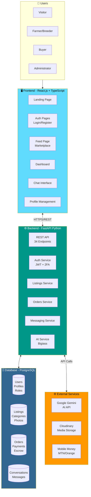

# System Architecture Diagram

## Mermaid Code (Copy to any Mermaid editor)

## Explanatory Text for Memoir

### Introduction (Before Figure)
The MBOA Market platform follows a modern three-tier architecture that separates concerns between presentation, business logic, and data persistence. This architectural choice ensures scalability, maintainability, and security. The system integrates with external services to provide AI-powered assistance, media storage, and mobile payment capabilities.

### Figure Caption
**Figure X.X: MBOA Market System Architecture Overview**

### Explanation (After Figure)
The architecture consists of four main layers:

1. **User Layer**: Four types of actors interact with the system - Visitors (unauthenticated users), Farmers/Breeders (sellers), Buyers, and Administrators.

2. **Frontend Layer**: Built with React.js and TypeScript, the frontend provides a responsive single-page application (SPA) with components for authentication, marketplace browsing, dashboard management, real-time chat, and profile management.

3. **Backend Layer**: Implemented using FastAPI (Python), the backend exposes 34 RESTful API endpoints organized into services: Authentication (JWT tokens with 2FA), Listings Management, Order Processing, Messaging, and AI Integration.

4. **Database Layer**: PostgreSQL stores all persistent data across 33 tables, organized into logical groups: User data, Marketplace data, Order/Payment data, and Messaging data.

5. **External Services**: The platform integrates with Google Gemini for AI-powered agricultural advice, Cloudinary for image and video storage, and Mobile Money providers (MTN MoMo, Orange Money) for payments.
