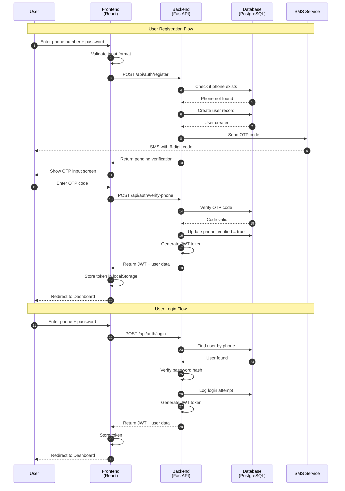

# Sequence Diagram - User Authentication

## Mermaid Code

## Explanatory Text for Memoir

### Introduction (Before Figure)
The authentication process is a critical component of the MBOA Market platform, ensuring secure access while maintaining a user-friendly experience. The system implements a phone-based authentication with OTP (One-Time Password) verification, which is particularly suited for the Cameroonian market where phone numbers are more commonly used than email addresses.

### Figure Caption
**Figure X.X: Sequence Diagram - User Authentication Process**

### Explanation (After Figure)
The authentication sequence involves two main flows:

**Registration Flow (Steps 1-14)**:
1. The user enters their phone number and password on the frontend
2. The frontend validates the input format before sending to the backend
3. The backend checks if the phone number already exists in the database
4. If the phone is new, a user record is created with `phone_verified = false`
5. An OTP code is generated and sent via SMS
6. The user enters the received OTP code
7. Upon successful verification, the phone is marked as verified
8. A JWT (JSON Web Token) is generated for session management
9. The user is redirected to their dashboard

**Login Flow (Steps 15-23)**:
1. The user enters their credentials
2. The backend retrieves the user record and verifies the password hash
3. The login attempt is logged for security auditing
4. A new JWT token is generated and returned
5. The frontend stores the token for subsequent API calls

This approach provides:
- **Security**: Password hashing with bcrypt, JWT tokens with expiration
- **Auditability**: All login attempts are logged
- **User Experience**: Phone-based auth familiar to local users
