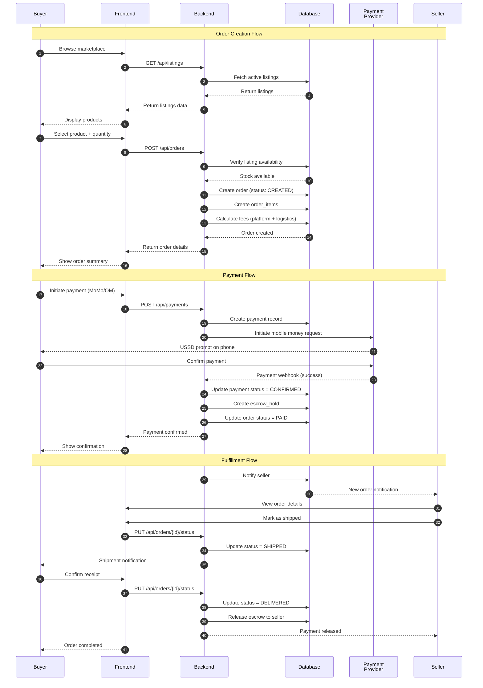

# Sequence Diagram - Order Process

## Mermaid Code

## Explanatory Text for Memoir

### Introduction (Before Figure)
The order process in MBOA Market follows a secure escrow-based model that protects both buyers and sellers. This sequence diagram illustrates the complete lifecycle of an order, from product selection to payment confirmation and delivery fulfillment. The escrow mechanism ensures that sellers receive payment only after the buyer confirms receipt of goods.

### Figure Caption
**Figure X.X: Sequence Diagram - Order and Payment Process**

### Explanation (After Figure)
The order process consists of three main phases:

**Phase 1: Order Creation (Steps 1-14)**
- The buyer browses the marketplace and views available listings
- Upon selecting a product and quantity, an order is created in the database
- The system calculates the total including platform fees (commission) and logistics fees
- The order is created with status `CREATED`

**Phase 2: Payment Processing (Steps 15-26)**
- The buyer initiates payment via Mobile Money (MTN MoMo or Orange Money)
- A payment record is created with a unique idempotency key
- The payment provider sends a USSD prompt to the buyer's phone
- Upon confirmation, a webhook notifies the backend
- The payment is marked as `CONFIRMED` and funds are held in escrow
- The order status changes to `PAID`

**Phase 3: Fulfillment (Steps 27-36)**
- The seller receives a notification about the new order
- The seller prepares and ships the goods, updating the status to `SHIPPED`
- The buyer receives the goods and confirms receipt
- The order status changes to `DELIVERED`
- The escrow is released, and the seller receives the payment

**Key Security Features**:
- **Escrow Protection**: Funds are held until delivery confirmation
- **Idempotency**: Prevents duplicate payments
- **Audit Trail**: All status changes are logged
- **Notifications**: Both parties are informed at each step
