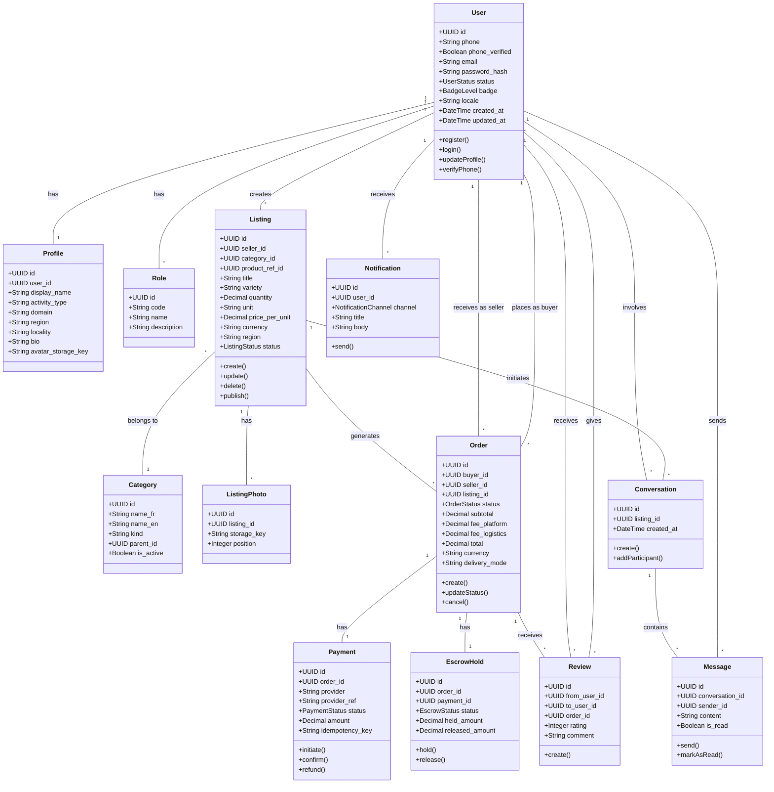

# UML Class Diagram - MBOA Market

## Mermaid Code

## Explanatory Text for Memoir

### Introduction (Before Figure)
The class diagram represents the object-oriented structure of the MBOA Market system. It shows the main entities, their attributes, methods, and relationships. This design follows the principles of domain-driven design, where each class represents a real-world concept in the agricultural marketplace domain.

### Figure Caption
**Figure X.X: UML Class Diagram - MBOA Market Domain Model**

### Explanation (After Figure)
The class diagram reveals the core domain model of MBOA Market:

**User Management Classes**:
- **User**: Central entity with authentication attributes (phone, password_hash) and status tracking (badge, status). Methods include register(), login(), and verifyPhone().
- **Profile**: Extended user information including display_name, activity_type (farmer, buyer, etc.), and location data.
- **Role**: Defines user permissions (ADMIN, SELLER, BUYER, TRANSPORTER).

**Marketplace Classes**:
- **Listing**: Represents a product for sale with quantity, price, and status. Linked to seller (User) and Category.
- **Category**: Hierarchical product classification with multilingual support (name_fr, name_en).
- **ListingPhoto**: Stores image references with position ordering.

**Transaction Classes**:
- **Order**: Links buyer and seller for a transaction, tracks status through lifecycle (CREATED → PAID → SHIPPED → DELIVERED).
- **Payment**: Handles mobile money transactions with provider integration.
- **EscrowHold**: Secures funds until delivery confirmation.

**Communication Classes**:
- **Conversation**: Groups messages between users, optionally linked to a listing.
- **Message**: Individual chat messages with read status tracking.

**Feedback Classes**:
- **Review**: Allows buyers to rate sellers after completed orders.
- **Notification**: System alerts sent to users via various channels.

**Key Relationships**:
- A User can have multiple Listings (1:N)
- A Listing belongs to one Category (N:1)
- An Order links one Buyer, one Seller, and one Listing
- Each Order has exactly one Payment and one EscrowHold (1:1)
