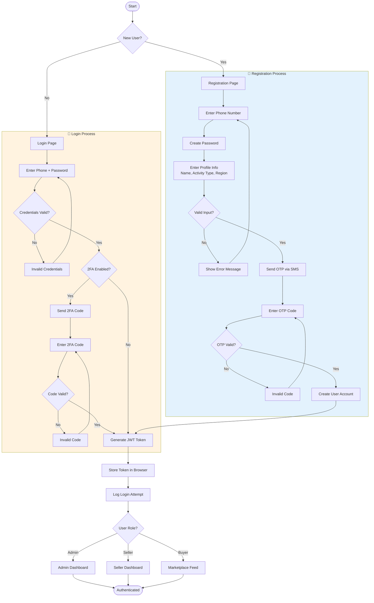

# Flowchart - Authentication Process

## Mermaid Code

## Explanatory Text for Memoir

### Introduction (Before Figure)
The authentication flowchart illustrates the complete user journey from initial access to authenticated session. MBOA Market implements a dual-path authentication system that handles both new user registration and returning user login. The process incorporates security measures including OTP verification for new accounts and optional two-factor authentication (2FA) for enhanced security.

### Figure Caption
**Figure X.X: Flowchart - User Authentication Process**

### Explanation (After Figure)
The authentication flow is divided into two main paths:

**Registration Path (Blue Section)**:
1. New users access the registration page
2. They enter their phone number (primary identifier in Cameroon)
3. They create a secure password
4. They provide profile information: display name, activity type (farmer, buyer, etc.), and region
5. Input validation ensures data integrity
6. An OTP (One-Time Password) is sent via SMS
7. The user enters the received code
8. Upon successful verification, the account is created

**Login Path (Orange Section)**:
1. Returning users access the login page
2. They enter their phone number and password
3. Credentials are validated against the database
4. If 2FA is enabled, an additional verification code is required
5. Upon successful authentication, a JWT token is generated

**Post-Authentication**:
- The JWT token is stored in the browser's localStorage
- The login attempt is logged for security auditing
- Users are redirected based on their role:
  - Administrators → Admin Dashboard
  - Sellers (Farmers/Breeders) → Seller Dashboard
  - Buyers → Marketplace Feed

**Security Features Highlighted**:
- Phone-based authentication (suited for local market)
- OTP verification prevents fake accounts
- Optional 2FA for sensitive accounts
- JWT tokens with expiration for session management
- Login attempt logging for audit trails
