# Flowchart - Order Process

## Mermaid Code

```mermaid
flowchart TD
    START([Buyer Browsing]) --> BROWSE[Browse Marketplace]
    
    subgraph Discovery["🔍 Product Discovery"]
        BROWSE --> FILTER[Apply Filters<br/>Category, Region, Price]
        FILTER --> SEARCH[Search by Keyword]
        SEARCH --> VIEW_LIST[View Listing Details]
        VIEW_LIST --> CHECK_STOCK{Stock Available?}
        CHECK_STOCK -->|No| OUT_STOCK[Out of Stock Message]
        OUT_STOCK --> BROWSE
        CHECK_STOCK -->|Yes| CONTACT{Contact Seller?}
    end
    
    subgraph Negotiation["💬 Negotiation (Optional)"]
        CONTACT -->|Yes| START_CHAT[Start Conversation]
        START_CHAT --> NEGOTIATE[Discuss Price/Quantity]
        NEGOTIATE --> AGREE{Agreement Reached?}
        AGREE -->|No| BROWSE
        AGREE -->|Yes| PROCEED
        CONTACT -->|No| PROCEED[Proceed to Order]
    end
    
    subgraph OrderCreation["🛒 Order Creation"]
        PROCEED --> SELECT_QTY[Select Quantity]
        SELECT_QTY --> CHOOSE_DELIVERY[Choose Delivery Mode<br/>Pickup / Delivery]
        CHOOSE_DELIVERY --> ENTER_ADDRESS{Delivery?}
        ENTER_ADDRESS -->|Yes| ADD_ADDRESS[Enter Delivery Address]
        ENTER_ADDRESS -->|No| SKIP_ADDR[Skip Address]
        ADD_ADDRESS --> CALC_FEES
        SKIP_ADDR --> CALC_FEES[Calculate Fees]
        CALC_FEES --> SHOW_SUMMARY[Show Order Summary<br/>Subtotal + Platform Fee + Logistics]
        SHOW_SUMMARY --> CONFIRM_ORDER{Confirm Order?}
        CONFIRM_ORDER -->|No| BROWSE
        CONFIRM_ORDER -->|Yes| CREATE_ORDER[Create Order in DB]
    end
    
    subgraph Payment["💳 Payment"]
        CREATE_ORDER --> SELECT_PAYMENT[Select Payment Method<br/>MTN MoMo / Orange Money]
        SELECT_PAYMENT --> INIT_PAYMENT[Initiate Payment]
        INIT_PAYMENT --> USSD[USSD Prompt on Phone]
        USSD --> ENTER_PIN[Enter Mobile Money PIN]
        ENTER_PIN --> PROCESS{Payment Success?}
        PROCESS -->|No| PAYMENT_FAIL[Payment Failed]
        PAYMENT_FAIL --> SELECT_PAYMENT
        PROCESS -->|Yes| CONFIRM_PAY[Payment Confirmed]
        CONFIRM_PAY --> ESCROW[Hold Funds in Escrow]
    end
    
    subgraph Fulfillment["📦 Fulfillment"]
        ESCROW --> NOTIFY_SELLER[Notify Seller]
        NOTIFY_SELLER --> SELLER_PREP[Seller Prepares Order]
        SELLER_PREP --> SHIP[Mark as Shipped]
        SHIP --> NOTIFY_BUYER[Notify Buyer]
        NOTIFY_BUYER --> RECEIVE[Buyer Receives Goods]
        RECEIVE --> CONFIRM_RECEIPT{Confirm Receipt?}
        CONFIRM_RECEIPT -->|No| DISPUTE[Open Dispute]
        DISPUTE --> RESOLVE[Admin Resolution]
        CONFIRM_RECEIPT -->|Yes| RELEASE[Release Escrow]
        RESOLVE --> RELEASE
    end
    
    RELEASE --> PAY_SELLER[Pay Seller]
    PAY_SELLER --> REVIEW[Leave Review]
    REVIEW --> COMPLETE([Order Complete ✓])
    
    style Discovery fill:#e3f2fd
    style Negotiation fill:#fff3e0
    style OrderCreation fill:#e8f5e9
    style Payment fill:#fce4ec
    style Fulfillment fill:#f3e5f5
```

## Explanatory Text for Memoir

### Introduction (Before Figure)
The order process flowchart illustrates the complete buyer journey from product discovery to order completion. MBOA Market implements an escrow-based payment system that protects both buyers and sellers, ensuring trust in transactions between parties who may not know each other. This process is designed to accommodate the realities of agricultural commerce in Cameroon, including optional negotiation and mobile money payments.

### Figure Caption
**Figure X.X: Flowchart - Complete Order Process**

### Explanation (After Figure)
The order process consists of five main phases:

**Phase 1: Product Discovery (Blue)**
- Buyers browse the marketplace with filtering options (category, region, price range)
- Keyword search enables finding specific products
- Listing details show product information, photos, and seller profile
- Stock availability is verified before proceeding

**Phase 2: Negotiation - Optional (Orange)**
- Buyers can contact sellers via the integrated chat system
- Price and quantity negotiations are common in agricultural trade
- This phase is optional; buyers can proceed directly to ordering

**Phase 3: Order Creation (Green)**
- Buyers select the desired quantity
- They choose between pickup or delivery
- For delivery, an address is required
- The system calculates:
  - Subtotal (quantity × price per unit)
  - Platform fee (commission)
  - Logistics fee (if delivery selected)
- An order summary is displayed for confirmation

**Phase 4: Payment (Pink)**
- Buyers select their preferred mobile money provider (MTN MoMo or Orange Money)
- A payment request is initiated
- The buyer receives a USSD prompt on their phone
- They enter their PIN to confirm
- Upon success, funds are held in escrow

**Phase 5: Fulfillment (Purple)**
- The seller is notified of the new order
- They prepare and ship the goods
- The buyer is notified of shipment
- Upon receiving goods, the buyer confirms receipt
- If there's an issue, a dispute can be opened for admin resolution
- Once confirmed, escrow is released to the seller
- The buyer can leave a review

**Key Features**:
- **Escrow Protection**: Funds are secured until delivery confirmation
- **Mobile Money Integration**: Supports local payment methods
- **Dispute Resolution**: Admin intervention for problematic transactions
- **Review System**: Builds trust through seller ratings
