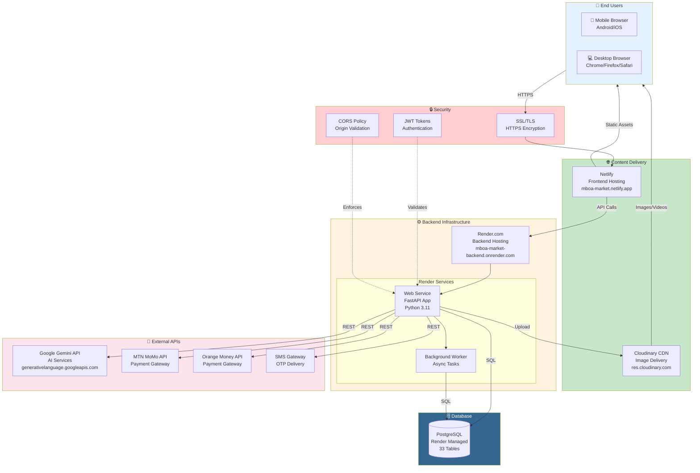

# Deployment Diagram - MBOA Market

## Mermaid Code

## Explanatory Text for Memoir

### Introduction (Before Figure)
The deployment diagram illustrates how the MBOA Market platform is deployed across various cloud services and infrastructure components. This architecture leverages modern cloud platforms to ensure scalability, reliability, and global accessibility. The deployment strategy prioritizes cost-effectiveness while maintaining performance for users across Cameroon.

### Figure Caption
**Figure X.X: Deployment Diagram - MBOA Market Cloud Infrastructure**

### Explanation (After Figure)
The deployment architecture consists of several interconnected components:

**End Users**
- Users access the platform via mobile browsers (Android/iOS) or desktop browsers
- The responsive design ensures optimal experience across all devices
- All communication is encrypted via HTTPS

**Content Delivery Network (CDN)**
- **Netlify**: Hosts the React frontend application
  - URL: `mboa-market.netlify.app`
  - Provides automatic SSL certificates
  - Global edge network for fast loading
  - Automatic deployments from Git
- **Cloudinary**: Delivers images and videos
  - URL: `res.cloudinary.com`
  - Automatic image optimization
  - Responsive image transformations

**Backend Infrastructure (Render.com)**
- **Web Service**: Runs the FastAPI application
  - URL: `mboa-market-backend.onrender.com`
  - Python 3.11 runtime
  - Auto-scaling based on traffic
- **Background Worker**: Handles asynchronous tasks
  - Email notifications
  - Payment processing callbacks
  - Data synchronization

**Database (PostgreSQL)**
- Managed PostgreSQL instance on Render
- 33 tables with full relational integrity
- Automatic backups and point-in-time recovery
- Connection pooling for performance

**External API Integrations**
- **Google Gemini**: AI-powered agricultural advice
- **MTN MoMo API**: Mobile money payments for MTN users
- **Orange Money API**: Mobile money payments for Orange users
- **SMS Gateway**: OTP delivery for authentication

**Security Measures**
- **SSL/TLS**: All traffic encrypted in transit
- **JWT Tokens**: Stateless authentication
- **CORS Policy**: Restricts API access to authorized origins
- **Environment Variables**: Secrets stored securely

**Deployment URLs**:
| Component | URL |
|-----------|-----|
| Frontend | https://mboa-market.netlify.app |
| Backend API | https://mboa-market-backend.onrender.com |
| API Docs | https://mboa-market-backend.onrender.com/docs |
