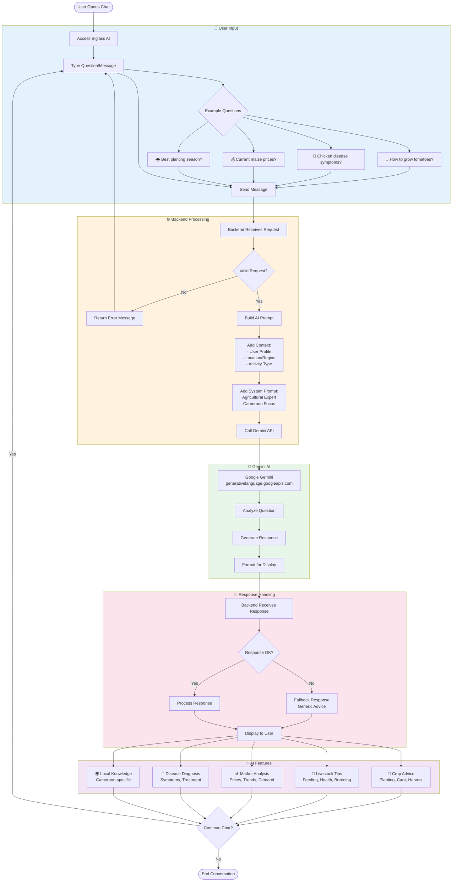

# Flowchart - AI Assistant (Bigiass)

## Mermaid Code

## Explanatory Text for Memoir

### Introduction (Before Figure)
Bigiass is the AI-powered virtual assistant integrated into MBOA Market, designed to provide agricultural advice and support to farmers and breeders. This flowchart illustrates how user questions are processed through the system and how the Google Gemini AI generates contextually relevant responses. The assistant is specifically trained to understand the agricultural context of Cameroon.

### Figure Caption
**Figure X.X: Flowchart - Bigiass AI Assistant Process**

### Explanation (After Figure)
The AI assistant process consists of four main phases:

**Phase 1: User Input (Blue)**
- Users access the Bigiass chat interface
- They can type questions in natural language
- Common question categories include:
  - Crop cultivation advice
  - Livestock health and care
  - Market prices and trends
  - Disease diagnosis
  - Seasonal planting guidance

**Phase 2: Backend Processing (Orange)**
- The backend receives and validates the request
- A comprehensive prompt is built including:
  - User's profile information (activity type, experience)
  - Geographic context (region, locality)
  - System instructions defining the AI's role as an agricultural expert
- The request is sent to the Gemini API

**Phase 3: Gemini AI Processing (Green)**
- Google Gemini analyzes the question
- It generates a response based on:
  - Agricultural knowledge base
  - Cameroon-specific context
  - User's specific situation
- The response is formatted for display

**Phase 4: Response Handling (Pink)**
- The backend receives the AI response
- If the API fails, a fallback response is provided
- The response is displayed to the user

**AI Features (Purple)**
The assistant provides expertise in five key areas:
1. **Crop Advice**: Planting techniques, care instructions, harvest timing
2. **Livestock Tips**: Feeding schedules, health monitoring, breeding practices
3. **Market Analysis**: Current prices, demand trends, selling strategies
4. **Disease Diagnosis**: Symptom identification, treatment recommendations
5. **Local Knowledge**: Cameroon-specific agricultural practices and conditions

**Technical Implementation**:
- Backend endpoint: `POST /api/ai/chat`
- AI Provider: Google Gemini API
- Fallback: Local response generation if API unavailable
- Context: User profile and location for personalized advice
