# MBOA Market - Use Case Diagram

## Acteurs

| Acteur | Description |
|----------|-------------|
| **Visiteur** | Utilisateur non authentifié |
| **Agriculteur / Eleveur** | Vendeur de produits agricoles ou d'elevage |
| **Acheteur** | Acheteur de produits agricoles |
| **Administrateur** | Gestionnaire de la plateforme |
| **Bigiass (IA)** | Assistant virtuel intelligent |

---

## Diagramme Mermaid

```mermaid
flowchart TB
    subgraph Acteurs
        V[Visiteur]
        A[Agriculteur / Eleveur]
        Ac[Acheteur]
        Ad[Administrateur]
        IA[Bigiass IA]
    end

    subgraph Authentification
        UC1[S'inscrire]
        UC2[Se connecter]
        UC3[Se deconnecter]
        UC4[Modifier profil]
        UC5[Ajouter email]
    end

    subgraph Gestion_Annonces
        UC6[Créer une annonce]
        UC7[Modifier une annonce]
        UC8[Supprimer une annonce]
        UC9[Ajouter des photos]
        UC10[Gerer le stock]
    end

    subgraph Recherche_Decouverte
        UC11[Parcourir les annonces]
        UC12[Rechercher par mot-cle]
        UC13[Filtrer par categorie]
        UC14[Filtrer par prix]
        UC15[Filtrer par region]
        UC16[Voir details d'une annonce]
    end

    subgraph Interaction_Social
        UC17[Aimer une publication]
        UC18[Commenter une publication]
        UC19[Partager une annonce]
        UC20[Contacter le vendeur]
        UC21[Discuter en direct]
    end

    subgraph Commandes_Paiement
        UC22[Ajouter au panier]
        UC23[Passer une commande]
        UC24[Choisir mode de livraison]
        UC25[Payer par MTN MoMo]
        UC26[Suivre la commande]
        UC27[Confirmer la reception]
    end

    subgraph Assistant_IA
        UC28[Poser une question]
        UC29[Conseils agricoles]
        UC30[Diagnostic maladies]
        UC31[Analyse prix marche]
        UC32[Recommandations cultures]
    end

    subgraph Administration
        UC33[Dashboard analytics]
        UC34[Moderer contenu]
        UC35[Gerer utilisateurs]
        UC36[Verifier KYC]
        UC37[Configurer categories]
    end

    V --> UC1
    V --> UC2
    V --> UC11
    V --> UC12
    V --> UC13
    V --> UC16

    A --> UC2
    A --> UC3
    A --> UC4
    A --> UC5
    A --> UC6
    A --> UC7
    A --> UC8
    A --> UC9
    A --> UC10
    A --> UC20
    A --> UC21
    A --> UC26

    Ac --> UC2
    Ac --> UC3
    Ac --> UC4
    Ac --> UC5
    Ac --> UC11
    Ac --> UC12
    Ac --> UC13
    Ac --> UC14
    Ac --> UC15
    Ac --> UC16
    Ac --> UC17
    Ac --> UC18
    Ac --> UC19
    Ac --> UC22
    Ac --> UC23
    Ac --> UC24
    Ac --> UC25
    Ac --> UC26
    Ac --> UC27
    Ac --> UC20
    Ac --> UC21

    IA --> UC28
    IA --> UC29
    IA --> UC30
    IA --> UC31
    IA --> UC32

    Ad --> UC33
    Ad --> UC34
    Ad --> UC35
    Ad --> UC36
    Ad --> UC37
```

---

## Cas d'utilisation detailles

### 1. Authentification
- **UC1 - S'inscrire** : Creer un compte avec telephone, email (optionnel), mot de passe, profil (nom, activite, domaine, region)
- **UC2 - Se connecter** : Authentification par telephone + mot de passe
- **UC3 - Se deconnecter** : Fermer la session
- **UC4 - Modifier profil** : Changer nom, region, activite, avatar
- **UC5 - Ajouter email** : Associer une adresse email au compte

### 2. Gestion des Annonces (Vendeur)
- **UC6 - Creer une annonce** : Titre, description, prix, quantite, categorie, photos
- **UC7 - Modifier une annonce** : Mettre a jour les informations
- **UC8 - Supprimer une annonce** : Retirer definitivement
- **UC9 - Ajouter des photos** : Uploader images du produit
- **UC10 - Gerer le stock** : Mettre a jour la quantite disponible

### 3. Recherche & Decouverte
- **UC11 - Parcourir les annonces** : Fil d'actualite avec publications
- **UC12 - Rechercher** : Par mot-cle (mais, tomate, poulet...)
- **UC13 - Filtrer par categorie** : Agriculture, Elevage, Maraichage...
- **UC14 - Filtrer par prix** : Fourchettes de prix
- **UC15 - Filtrer par region** : Adamaoua, Centre, Littoral...
- **UC16 - Voir details** : Photos, description, vendeur, prix, localisation

### 4. Interaction Sociale
- **UC17 - Aimer (Like)** : Mettre un "J'aime" sur une publication
- **UC18 - Commenter** : Laisser un commentaire sur une publication
- **UC19 - Partager** : Diffuser une annonce
- **UC20 - Contacter vendeur** : Initier une conversation
- **UC21 - Discuter en direct** : Chat temps reel avec le vendeur

### 5. Commandes & Paiement
- **UC22 - Ajouter au panier** : Selectionner des articles
- **UC23 - Passer commande** : Confirmer l'achat
- **UC24 - Choisir livraison** : Mode de livraison (pickup, livraison)
- **UC25 - Payer** : Paiement via MTN MoMo / Orange Money
- **UC26 - Suivre commande** : Statut en temps reel
- **UC27 - Confirmer reception** : Valider la livraison

### 6. Assistant IA (Bigiass)
- **UC28 - Poser question** : Dialogue naturel avec l'IA
- **UC29 - Conseils agricoles** : Recommandations de culture
- **UC30 - Diagnostic maladies** : Identifier problemes plantes/animaux
- **UC31 - Analyse prix marche** : Tendances et conseils de vente
- **UC32 - Recommandations** : Suggestions personnalisees

### 7. Administration
- **UC33 - Dashboard analytics** : Stats utilisateurs, ventes, visites
- **UC34 - Moderer contenu** : Approuver/supprimer publications
- **UC35 - Gerer utilisateurs** : Suspendre, bannir, verifier
- **UC36 - Verifier KYC** : Valider identite des vendeurs
- **UC37 - Configurer categories** : Ajouter/modifier categories

---

## Relations entre cas d'utilisation

### Include (Inclusion)
- **Passer commande** INCLUDE **Choisir mode de livraison**
- **Passer commande** INCLUDE **Payer**
- **Creer annonce** INCLUDE **Ajouter des photos**

### Extend (Extension)
- **Contacter vendeur** EXTEND **Discuter en direct**
- **Voir details annonce** EXTEND **Contacter vendeur**
- **Aimer** EXTEND **Voir details annonce**

---

*Diagramme genere pour MBOA Market - Plateforme Agricole du Cameroun*
*Date : Juin 2026*
